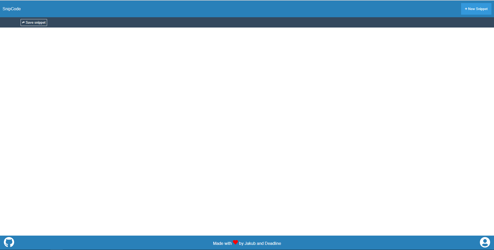

# SnipCodeAPI
SnipCode - Application for creating & sharing the text snippets.

It was made with ASP.NET Core on LiteDB database and Hangfire library on backend and with Vue.js including Vue-Router and Vuex on frontend
This project was a good occassion for me to try with basics of writing Unit Tests using NUnit framework.

# Images

